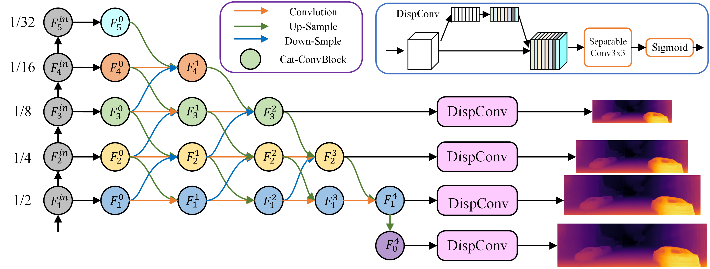
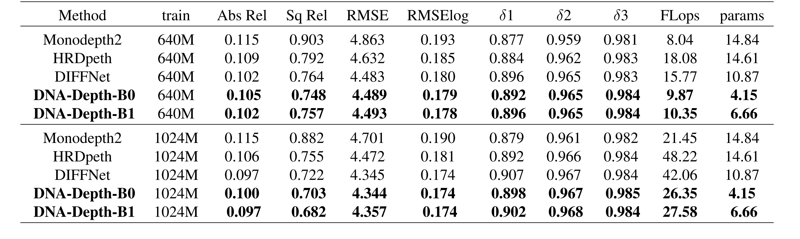
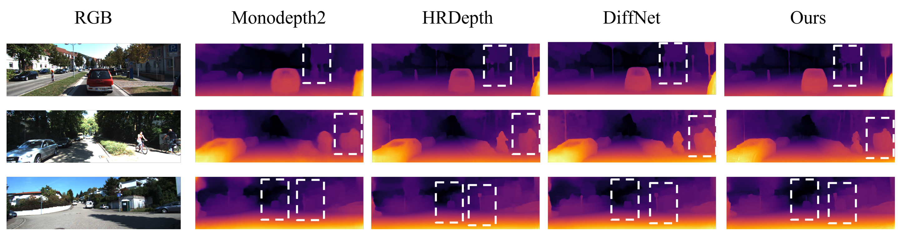

# DNA-Depth

This project is for **[Deep Neighbor Layer Aggregation for Lightweight Self-Supervised Monocular Depth Estimation](https://arxiv.org/abs/2309.09272)
ICASSP  2024**

This code uses PyTorch implementation for training and testing depth estimation models.
The schematic of the network is shown below: 
<p>
  
</p>

## Setup
Assuming a fresh [Anaconda](https://www.anaconda.com/download/) distribution, you can install the dependencies with:
```shell
conda create -n dna python=3.6
conda activate dna
conda install six matplotlib scikit-image ipython 
conda install pytorch==1.7.0 torchvision==0.8.0 torchaudio==0.7.0 cudatoolkit=11.0 -c pytorch
pip install tensorboardX==2.2 opencv-python==4.5.3.56
```

## Our results
<p>
  
</p>
<p>
  
</p>

## Train

```shell
python train.py 
```

## Test

```shell
python evaluate_depth.py --load_weights_folder mono_640m_b0 --eval_mono --png

```

## Trained models on KITTI

| `--model_name`                                                                                          | Model resolution | KITTI abs. rel. error | delta < 1.25 | FLops   | params |
|---------------------------------------------------------------------------------------------------------|------------------|-----------------------|--------------|---------|--------|
| [`mono_640m_b0`](https://drive.google.com/drive/folders/1fANqFBYo0qx9SsLj5uIOmp7w50DWy1dl?usp=sharing)  | 640 x 192        | 0.105                 | 0.892        | 9.87    | 4.15   |
| [`mono_640m_b1`](https://drive.google.com/drive/folders/1fpvW2Vc3CRQtII2LeyAooKtERGCZHnj1?usp=sharing)  | 640 x 192        | 0.102                 | 0.896        | 10.35   | 6.66   |
| [`mono_1024m_b0`](https://drive.google.com/drive/folders/1FvcJVplt8hLFW69kEICMu3VyHUY_V-IU?usp=sharing) | 1024 x 320       | 0.100                 | 0.898        | 26.35   | 4.15   |
| [`mono_1024m_b1`](https://drive.google.com/drive/folders/1xMhPdt3RLr8peEGS0ZwRgCwMXZQG04W8?usp=sharing) | 1024 x 320       | 0.097                 | 0.902        | 27.58   | 6.66   |


#### Acknowledgement
 Thanks the authors for their works:
 - [monodepth2](https://github.com/nianticlabs/monodepth2)
 - [HRNet](https://github.com/HRNet/HRNet-Semantic-Segmentation)
 - [DIFFNet](https://github.com/brandleyzhou/DIFFNet)
